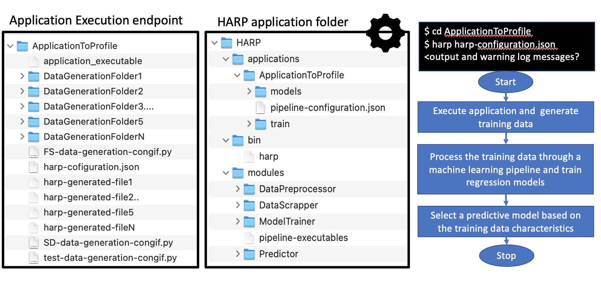

[](https://opensource.org/licenses/BSD-3-Clause)

HARP - HPC Application Resource Predictor
==============================================================

Overview
--------

Researchers use high-performance computing (HPC) cyberinfrastructures (CI) like Ohio Supercomputer (OSC) or Texas Advanced Computing Center (TACC) to execute computationally intensive diverse scientific workflows. Some workflows are heavy on IO, like genome sequencing (cleaning and assembly), while others, like training DNNs, could be compute (and memory) intensive. Each workflow has a unique resource requirement, and it is essential to profile and understand these needs to allocate shared resources for optimal utilization of the cyberinfrastructure. These resources are expensive, and several jobs compete to get these allocations, sometimes with reasonable wait times (while requesting enormous resources for a long time). Estimating the expected resources for optimally utilizing the compute and memory is challenging especially considering the need for sufficient history to enable these predictions tailored for unique workflows and execution environments. We explored and established a framework (as showsn in Figure 1) that pipelines the solutions to address these challenges. The framework is configured to generate a history of executions and train suitable regression models to estimate the approximate execution time for a targeted application.


<!-- 


 -->
 
 
  Figure 1: The Proposed Framework: training data generation, building regression models & selecting the best model based on custom criteria
  
  
**Components and Characteristics of the framework (from figure 1)**:
Generating and Preparing Training Data: This module automatically and systematically generates comprehensive, diverse "scaled-down(SD)" and limited, selective "full-scale(FS)" runs with minimal human intervention. We use Cheetah (https://github.com/CODARcode/cheetah) to execute the target application with the pre-defined data generation configurations (SD and FS) to generate the history-of-runs training data.
Building Regression Models: This module standardizes and prepares the data, trains the selected off-the-shelf regression models with the appropriate hyper-parameters, and stores them for inference. In this phase, the data generated in the first phase is processed to train regression models. Redundant features are eliminated, outliers are removed, and features are transformed to reduce the dimensionality before training the regression models. 
Selecting Appropriate Prediction Model: this module selects the most appropriate regression model from a pool of trained models from phase 2 with respect to a given policy and target application
  
  
 
 Figure 2: Shows the target-application execution endpoint and the harp application folder structure. 

 
 
 
Installation
------------
* Dependency: Linux, Python 3.9(only), jq(command line JSOM parser https://stedolan.github.io/jq/)
* On supercomputers it should be installed at a location accessible from the parallel file system
* **Follow these steps to set up Harp as a loadable software module on Ohio Supercomputer (OSC):**
  ```bash
  git clone https://github.com/ICICLE-ai/harp.git
  cd harp
  chmod 755 *
  ./install-osc-harp.sh
  ```
  If the installation fails for any reason, please re-run the script 'install-osc-harp.sh' after deleting the environmnet 'harp-env' and running the cleanup.sh in the install directory. 
  ```bash
  conda remove --name harp-env --all
  ./cleanup.sh
  ```
** Follow the installtion prompts to proceed with the setup. This setup installs miniconda, CODAR Cheetah (https://github.com/CODARcode/cheetah), TensorFlow, psutil, pandas and scikit-learn and configures the Harp framework. It takes abiut 30-40 mins to finish the setup.
* **Follow these steps to setup HARP framewok on a stand-alone linux system:**
  ```bash
  WILL ADD THESE 
  ```
* Harp has been tested on Ownes (OSC), and standalone Linux system.

### Loading the HARP module 
   ```bash
  module use $HOME/osc_apps/lmodfiles
  module load harp 
  export CONDA_HOME=<path_to_miniconda>/miniconda3
   ```
   
### Using HARP to profile an application and predict execution time
1. Navigate to the target application folder and copy the all the files from /Post_Execution_Scripts/basic into the the current folder. For more details about the type of application categories and profiling, please read the document or PPT <ADD LINK>. 
2. Edit path in post-script.sh to point to the target application directory
3. Execute the framework as per the configurations in file 'train_config.json' as follows:
 ```bash
  cd <path_to_application>
  chmod 755 *
  harp <pipeline-configration>.json
  ```
4. The results of the framework are stores in rpredictions.json file uner the target application folder
Please find the sample application under the example folder and follow it's read-me files to execute the framework against profiling and estimating the rsource needs. 

NOTE
-------------
Things to consider while using the framework
1.[OSC Installation] The installer creates a conda environmnet "harp_env" on OSC and uses this environment to execute the framework. Please delete the evironment if it already exists with this name for this version of framework. The enviroment name is used in a couple of Cheetash configurations and hence is mandated to use the same name "harp_env" while installing the application.
2. The below response:
  (OSC Install Script) Generating Module File Step: /users/PAS0536/swathivm/osc_apps/lmodfiles/harp/1.0.lua

  (OSC Install Script) Generating Module File Step Finished
  Finished at Thu Mar 16 11:44:13 EDT 2023
  Execution time: 1965 seconds

Documentation
-------------
<LINK TO VIDEO> 
<LINK TO PPT>

Releases
--------
The current release is [1.0.0](https://github.com/<RELEASE PATH>).

### Supported Systems
System Name | Cheetah Support | CPU | GPU 
:-----------| :---------------| :---------------| :---------------
Local Linux machines | :white_check_mark: | :white_check_mark: 
Owens (OSC) | :white_check_mark: | :white_check_mark: | :white_check_mark: 
Pitzer (OSC) | :white_check_mark: | :white_check_mark: | :white_check_mark: 

Authors
-------


Citing Harp
--------------
<Paper>

Reporting Bugs
--------------
Please open an issue on the [github issues](https://github.com/<PATH>/issues) page to report a bug.

License
-------
Harp is licensed under the https://opensource.org/licenses/BSD-3-Clause
