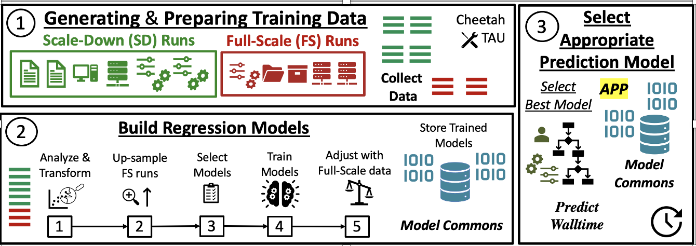

[](https://opensource.org/licenses/BSD-3-Clause)

HARP - HPC Application Resource Predictor
==============================================================

Overview
--------

Researchers use high-performance computing (HPC) cyberinfrastructures (CI) like Ohio Supercomputer (OSC) or Texas Advanced Computing Center (TACC) to execute computationally intensive diverse scientific workflows. Some workflows are heavy on IO, like genome sequencing (cleaning and assembly), while others, like training DNNs, could be compute (and memory) intensive. Each workflow has a unique resource requirement, and it is essential to profile and understand these needs to allocate shared resources for optimal utilization of the cyberinfrastructure. These resources are expensive, and several jobs compete to get these allocations, sometimes with reasonable wait times (while requesting enormous resources for a long time). Estimating the expected resources for optimally utilizing the compute and memory is challenging especially considering the need for sufficient history to enable these predictions tailored for unique workflows and execution environments. We explored and established a framework (as showsn in Figure 1) that pipelines the solutions to address these challenges. The framework is configured to generate a history of executions and train suitable regression models to estimate the approximate execution time for a targeted application.


<!-- 


 -->
 
 
 
 
 
Installation
------------
* Dependency: Linux, Python 3.9(only)
* On supercomputers it should be installed at a location accessible from the parallel file system
* Fowwlow the steps to set up Harp as a loadable software module:
  ```bash
  git clone https://github.com/ICICLE-ai/harp.git
  cd harp
  chmod 755 *
  ./install-osc-harp.sh
  ```
* Follow the installtion prompts to proceed with the setup. This setup installs CODAR Cheetah (https://github.com/CODARcode/cheetah), TensorFlow, psutil, pandas and scikit-learn and configures the Harp framework. It takes abiut 30-40 mins to finish the setup.
* Harp has been tested on Ownes (OSC), and standalone Linux computers

### Loading the HARP module to execute
   ```bash
  module use $HOME/osc_apps/lmodfiles
  module load harp 
  export CONDA_HOME=<path_to_miniconda>/miniconda3
  harp <Confilguration-file.json>
   ```
   
### Using HARP to profile an application and predict execution time
We use a sinple python program to compute the euler number as a target application to profile by using the following script
 ```bash
  cd <path_to_application>/01-eulers_number
  chmod 755 *
  harp train_config.json
  ```
The eulers number and other examples could be found in folder "examples"

NOTE
-------------
Things to consider while using the framework
1. The installer creates a conda environmnet "harp_env" and uses this environmentto execute the framework. Please delete the evironment if it already exists with this name for this version of framework. It uses the name "harp_env" at couple of places hardcoded (while executing CODARCheetah) and hence is mandated to use the same environment name for this release. 
2. The below response:
  (OSC Install Script) Generating Module File Step: /users/PAS0536/swathivm/osc_apps/lmodfiles/harp/1.0.lua

  (OSC Install Script) Generating Module File Step Finished
  Finished at Thu Mar 16 11:44:13 EDT 2023
  Execution time: 1965 seconds

Documentation
-------------
<LINK TO VIDEO> 
<LINK TO PPT>

Releases
--------
The current release is [1.0](https://github.com/<RELEASE PATH>).

### Supported Systems
System Name | Cheetah Support 
:-----------| :---------------
Local Linux machines | :white_check_mark: 
Owens (OSC) | :white_check_mark: 

Authors
-------


Citing Harp
--------------
<Paper>

Reporting Bugs
--------------
Please open an issue on the [github issues](https://github.com/<PATH>/issues) page to report a bug.

License
-------
Harp is licensed under the https://opensource.org/licenses/BSD-3-Clause
